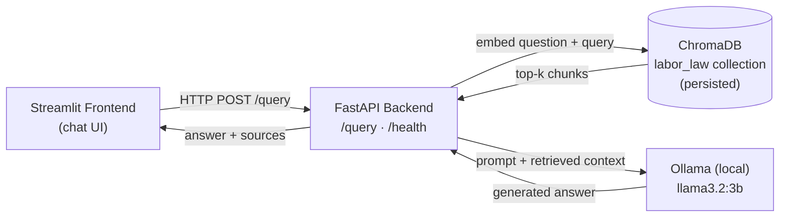

# ⚖️ Egyptian Labor Law RAG Assistant

A Retrieval-Augmented Generation (RAG) web app that answers questions about **Egyptian Labor Law No. 14 of 2025**, grounded in the actual law text with article-level citations. Built as an individual graduation project (Level 2 Summer Training, Core Track).

Ask a question like *"How long is maternity leave?"* and get an answer sourced directly from the retrieved article — not the LLM's own memory.

## Overview

The pipeline goes: PDF law text → cleaned & chunked by article → embedded and stored in a persistent Chroma vector database → retrieved at query time → grounded, cited answer generated by a local Ollama LLM → served via FastAPI → displayed in a Streamlit chat interface.

Everything runs locally — no external API keys or paid services required.

## Architecture



*(Built once, at setup time, and loaded by the backend at startup — not shown above: the `notebooks/rag_pipeline.ipynb` step that chunks `labor_law_14_2025.pdf`, embeds it with `all-MiniLM-L6-v2`, and persists it into the ChromaDB store.)*

The vector store is built once in the notebook (`notebooks/rag_pipeline.ipynb`) and persisted to disk — the FastAPI backend loads it at startup and never rebuilds it at request time.

## Tech Stack

| Layer | Technology |
|---|---|
| Backend | FastAPI, Pydantic / pydantic-settings |
| Vector store | ChromaDB (persistent client) |
| Embeddings | `sentence-transformers` — `all-MiniLM-L6-v2` |
| LLM | Ollama — `llama3.2:3b` (local) |
| Frontend | Streamlit (chat interface) |
| Testing | pytest + FastAPI `TestClient` |
| Notebook | Jupyter — pipeline build & evaluation |

## Project Structure

```
rag-assistant-app/
├── notebooks/
│   └── rag_pipeline.ipynb        # Load, chunk, embed, retrieve, evaluate
├── backend/
│   ├── app/
│   │   ├── main.py               # FastAPI app, CORS, startup loading
│   │   ├── api/routes/query.py   # GET /health, POST /query
│   │   ├── core/config.py        # Settings from .env
│   │   ├── schemas/query.py      # QueryRequest / QueryResponse
│   │   ├── services/
│   │   │   ├── retrieval.py      # Load vector store, retrieve chunks
│   │   │   └── generation.py     # Build prompt, call Ollama LLM
│   │   └── utils/logging_config.py
│   ├── data/vector_store/        # Persisted Chroma collection (copied from notebook)
│   ├── tests/test_query.py
│   ├── requirements.txt
│   ├── .env.example
│   └── Dockerfile
├── frontend/
│   ├── app.py                    # Streamlit chat app
│   ├── api_client.py             # Backend API wrapper
│   └── requirements.txt
├── data/
│   ├── raw/labor_law_14_2025.pdf # Source document
│   └── vector_store/             # Notebook's own copy of the persisted store
└── .gitignore
```

## Domain & Data

- **Source:** `labor_law_14_2025.pdf` — an unofficial English translation of Egyptian Labor Law No. 14 of 2025 (112 pages, born-digital PDF, no OCR needed).
- **Chunking strategy:** article-boundary chunking rather than fixed-size windows. Since the source is a numbered legal code where every article is a self-contained rule, a regex (`Article \d{1,3}\s*[:–]`) splits the text at each article heading, so cross-references elsewhere in the text (e.g. *"in accordance with Article 12"*) aren't mistaken for headings. This keeps each rule intact in its own chunk and gives every retrieved chunk a meaningful citation (e.g. *Article 54*) instead of an arbitrary index.
- **Result:** 310 chunks from 1 source document, stored in a Chroma collection named `labor_law`.

## Setup

### Prerequisites
- Python 3.10+
- [Ollama](https://ollama.com) installed and running, with the model pulled:
  ```bash
  ollama pull llama3.2:3b
  ```

### Backend

```bash
cd backend
python -m venv .venv
.venv\Scripts\activate        # Windows
# source .venv/bin/activate   # macOS / Linux

pip install -r requirements.txt
copy .env.example .env        # Windows
# cp .env.example .env        # macOS / Linux

uvicorn app.main:app --reload
```

The backend starts at `http://localhost:8000`. Visit `http://localhost:8000/docs` for interactive Swagger docs.

### Frontend

In a separate terminal:

```bash
cd frontend
python -m venv .venv
.venv\Scripts\activate        # Windows
# source .venv/bin/activate   # macOS / Linux

pip install -r requirements.txt
```

Create a `.env` file in `frontend/`:
```
API_BASE_URL=http://localhost:8000
```

Then run:
```bash
streamlit run app.py
```

The chat UI opens at `http://localhost:8501`.

## Environment Variables

**Backend** (`backend/.env`):

| Variable | Default | Description |
|---|---|---|
| `VECTOR_STORE_DIR` | `data/vector_store` | Path to the persisted Chroma store |
| `COLLECTION_NAME` | `labor_law` | Chroma collection name |
| `EMBEDDING_MODEL` | `all-MiniLM-L6-v2` | Sentence-transformer model used for embeddings |
| `LLM_MODEL` | `llama3.2:3b` | Ollama model used for generation |
| `TOP_K` | `3` | Number of chunks retrieved per query |
| `CORS_ORIGINS` | `http://localhost:8501` | Comma-separated list of allowed frontend origins |

**Frontend** (`frontend/.env`):

| Variable | Default | Description |
|---|---|---|
| `API_BASE_URL` | `http://localhost:8000` | Base URL of the backend API |

## API Reference

### `GET /health`
Returns backend and vector store status.

```json
{
  "status": "ok",
  "vector_store_loaded": true,
  "num_chunks": 310
}
```

### `POST /query`

**Request:**
```json
{ "question": "How long is maternity leave?" }
```

**Response:**
```json
{
  "answer": "According to Article 54, a female worker is entitled to maternity leave for four months...",
  "sources": ["Article 54", "Article 57", "Article 55"]
}
```

**curl example:**
```bash
curl -X POST http://localhost:8000/query \
  -H "Content-Type: application/json" \
  -d '{"question": "How long is maternity leave?"}'
```

Invalid input (empty or missing `question`) returns `422 Unprocessable Entity`.

## Evaluation Results

10 test questions were run end-to-end through the full pipeline (retrieve → prompt → generate) and manually checked against the source law text. All 10 returned correctly grounded, accurately cited answers — no hallucinations or retrieval misses observed.

| Question | Retrieved Sources | Correct? |
|---|---|---|
| Paid annual leave in first year? | Article 124, 125, 131 | ✅ |
| Maternity leave length & frequency? | Article 54, 57, 55 | ✅ |
| Maximum probation period? | Article 90, 6, 124 | ✅ |
| Fire employee during maternity leave? | Article 55, 54, 58 | ✅ |
| Child under 15 training hours/day? | Article 62, 65, 117 | ✅ |
| Minimum retirement age? | Article 171, 28, 61 | ✅ |
| Notice before terminating open-ended contract? | Article 164, 156, 158 | ✅ |
| Penalty for excessive wage deductions? | Article 140, 142, 139 | ✅ |
| Compensation for unjustified dismissal? | Article 127, 165, 150 | ✅ |
| Breastfeeding breaks entitlement? | Article 56, 57, 54 | ✅ |

Full detail (including generated answer text) is in `data/vector_store/evaluation_results.csv` and Section 2.6 of the notebook.

**Note:** the top-`k=3` retrieval consistently surfaced the correct article(s) for every test question, likely helped by the article-boundary chunking strategy keeping each rule (and its citation) as a single, self-contained unit.

## Screenshots

*(Add screenshots of the Streamlit chat UI here — a question being asked and a grounded answer with sources displayed.)*

## Running Tests

```bash
cd backend
pytest
```

Covers: `/health` endpoint, a happy-path `/query`, and invalid input returning `422`.

## Notes

- This is the **Core Track** (text-only RAG) — no Computer Vision/YOLO component.
- This assistant is for informational purposes only and does not constitute legal advice.
